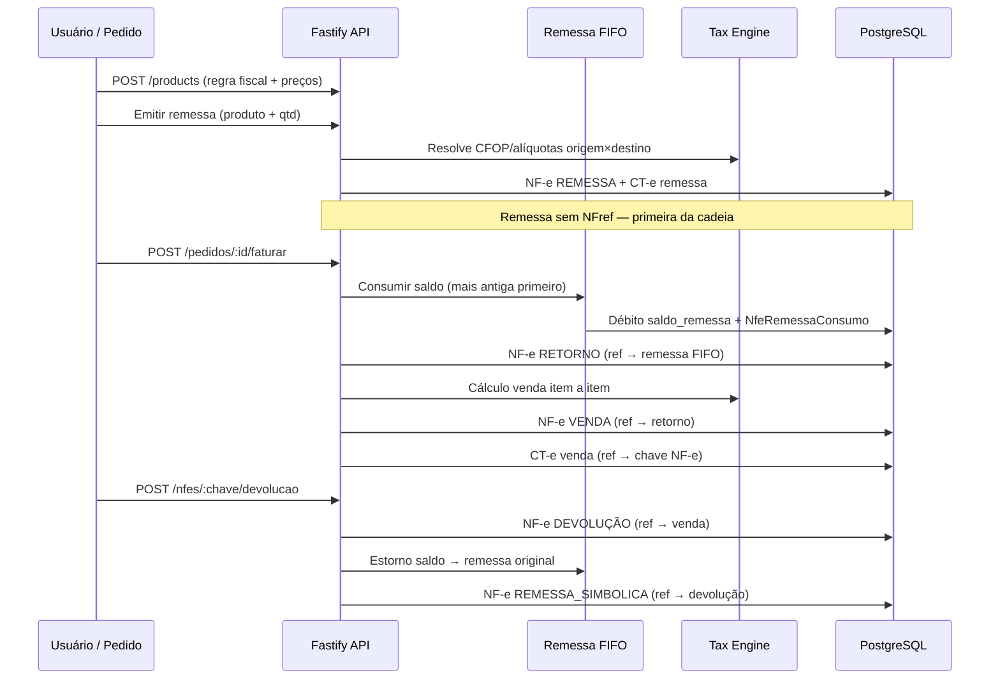
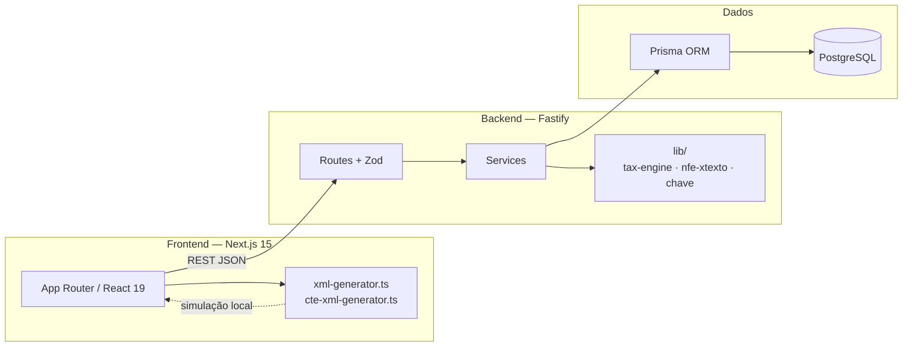

# E-Invoice Play

[](https://nextjs.org/)
[](https://fastify.dev/)
[](https://www.prisma.io/)
[](https://www.postgresql.org/)
[](https://www.typescriptlang.org/)

**E-Invoice Play** é um cockpit fiscal e logístico para simular emissão de **NF-e (modelo 55, v4.00)** e **CT-e (modelo 57)** em operações de **fulfillment** — o mesmo desenho operacional usado por marketplaces com depósito temporário (full), cruzamento **origem × destino (UF)** e cadeias documentais encadeadas por `refNFe`.

> **Aviso legal:** simulador educacional e de arquitetura. XMLs gerados usam homologação (`tpAmb=2`), assinaturas fictícias e **não possuem validade** perante a SEFAZ. Não utilize em produção fiscal real sem certificação, transmissão e assessoria especializada.

---

## Índice

- [Visão geral](#visão-geral)
- [Fluxo operacional (fulfillment)](#fluxo-operacional-fulfillment)
- [Arquitetura do sistema](#arquitetura-do-sistema)
- [Engine tributária](#engine-tributária)
- [Documentos fiscais suportados](#documentos-fiscais-suportados)
- [Stack e estrutura do monorepo](#stack-e-estrutura-do-monorepo)
- [API REST (resumo)](#api-rest-resumo)
- [Interface web](#interface-web)
- [Como rodar localmente](#como-rodar-localmente)
- [Scripts úteis](#scripts-úteis)
- [Dados de referência (XMLs/)](#dados-de-referência-xmls)
- [Roadmap e limitações](#roadmap-e-limitações)

---

## Visão geral

O sistema cobre o ciclo típico de um seller no full:

1. **Cadastro** de produtos com regra fiscal, preço de venda e preço de custo (remessa).
2. **Remessa** de estoque para o depósito do operador logístico (ML).
3. **Retorno simbólico** + **venda** ao consumidor, consumindo saldo FIFO da remessa.
4. **Devolução** referenciada à venda, com **remessa simbólica** de retorno de saldo ao full.
5. **CT-e** de transporte vinculado à remessa e à venda (referência `infNFe`).

Tudo é **multi-tenant**: cada empresa (`Tenant`) tem séries, configurações fiscais, produtos e documentos isolados.

---

## Fluxo operacional (fulfillment)

### Cenários completos modelados

```mermaid
flowchart TB
  subgraph C1["Cenário 1 — Venda simples"]
    R1[Remessa física<br/>sem refNFe] --> RT1[Retorno simbólico<br/>refNFe → remessa]
    RT1 --> V1[Venda<br/>refNFe → retorno]
  end

  subgraph C2["Cenário 2 — Devolução ao full"]
    R2[Remessa] --> RT2[Retorno] --> V2[Venda]
    V2 --> D2[Devolução<br/>refNFe → venda]
    D2 --> RS2[Remessa simbólica<br/>refNFe → devolução]
    RS2 --> RT2b[Retorno] --> V2b[Nova venda]
  end

  subgraph C3["Cenário 3 — Avanço entre CDs"]
    R3[Remessa CD A] --> RS3[Remessa simbólica<br/>saída CD A]
    RS3 --> R3b[Remessa física CD B]
    R3b --> RT3[Retorno] --> V3[Venda]
  end
```



### Sequência de emissão (backend)



### Regras de referência (`refNFe` no XML)

| Tipo de NF-e | Possui `refNFe`? | Referencia |
|--------------|------------------|------------|
| Remessa física (entrada estoque no full) | Não | — (documento raiz) |
| Retorno simbólico | Sim | Remessa cujo saldo foi consumido (FIFO) |
| Venda | Sim | Retorno simbólico |
| Devolução | Sim | Venda |
| Remessa simbólica | Sim | Devolução |

A **timeline** na home agrupa cenários por remessa física: cada venda gera um “Cenário N” sob a mesma remessa de origem.

---

## Arquitetura do sistema



| Camada | Responsabilidade |
|--------|------------------|
| **Routes** | Contratos HTTP, validação Zod, status codes |
| **Services** | Regras de negócio: remessa, cadeia venda, devolução, FIFO, CT-e |
| **lib/tax-engine** | Cálculo puro ICMS “por dentro”, PIS/COFINS/IPI, totais = soma dos itens |
| **lib/tax-calculation-service** | Ponte planilha/Prisma → engine |
| **Frontend lib/** | Geração de XML fiel ao layout ML (simulação visual) |

Princípios: **monolito modular** (pnpm workspaces), multi-tenancy por `tenant_id`, sem transmissão SEFAZ.

---

## Engine tributária

A engine (`backend/src/lib/tax-engine.ts`) implementa:

- **Base de cálculo em cascata:** `vBC = vProd + vFrete + despesas − vDesc`
- **ICMS embutido** (“imposto por dentro”) por item
- **Arredondamento comercial** em 2 casas em cada `<det>`
- **`<ICMSTot>`** exclusivamente como `reduce()` dos itens (evita divergência 532/533)
- **DIFAL / FCP** quando configurado no emitente e interestadual

As alíquotas vêm da tabela `TaxRule`, importada por planilha, cruzando:

- UF origem × UF destino  
- Tipo de transação (`sale`, `inbound`, remessa…)  
- Tipo de cliente (`taxpayer` / `non_taxpayer`)  
- `taxRuleBaseId` no produto  

---

## Documentos fiscais suportados

### NF-e

| Tipo | `tpNF` | Uso do preço | CT-e |
|------|--------|--------------|------|
| `REMESSA` | Saída | `precoCusto` | Sim (→ full) |
| `RETORNO_SIMBOLICO` | Entrada | Custo / regra inbound | Não |
| `VENDA` | Saída | `preco` (venda) | Sim (→ consumidor) |
| `DEVOLUCAO` | Entrada | Espelha venda | Não |
| `REMESSA_SIMBOLICA` | Saída | `precoCusto` | Não |

### Tag `xTexto` (`obsCont`, `xCampo="external_id"`)

Padrão extraído dos XMLs reais em `XMLs/` (Mercado Livre / OLSS):

| Operação | Exemplo de `xTexto` |
|----------|---------------------|
| Remessa | `INBOUND-inbound-{pedidoMl}-1-1-OLSS-279642028` |
| Retorno | `SALE-symbolic_inbound_return-{pedidoMl}-1-OLSS-279642028` |
| Venda | `SALE-sale-{pedidoMl}-1-OLSS-279642028` |
| Venda consumidor final | `{pedidoMl}` (somente ID) |
| Devolução | `DEVOLUTION-devolution-{pedidoMl}-1-OLSS-279642028` |
| Remessa simbólica | `DEVOLUTION-symbolic_inbound-{pedidoMl}-1-OLSS-279642028` |

Gerado em `nfe-xtexto.ts` e persistido em `fiscalPayload.obsContXTexto`.

### CT-e

- **Remessa:** transporte emitente → depósito full (`cte-remessa-service`)
- **Venda:** transporte full → consumidor (`cte-venda-service`), com `<infNFe><chave>…</chave></infNFe>`

---

## Stack e estrutura do monorepo

```
e-invoice-play/
├── backend/                    # API Fastify + engine fiscal (ver `backend/docs/COMENTARIOS.md`)
│   ├── prisma/                 # Schema, migrations, seed
│   └── src/
│       ├── lib/                # tax-engine, nfe-xtexto, chaves, mappers
│       ├── routes/             # REST
│       ├── schemas/            # Zod
│       └── services/           # remessa, venda-chain, devolucao, fifo, cte-*
├── frontend/                   # Next.js 15 App Router
│   └── src/
│       ├── app/                # Dashboard, NF-e, CT-e, produtos, regras…
│       ├── components/
│       └── lib/                # xml-generator, fiscal-api, tipos
├── XMLs/                       # XMLs reais de referência (ML) — não versionar em PR público se sensível
├── docker-compose.yml
└── package.json                # Scripts raiz (pnpm workspaces)
```

**Backend:** Fastify · Zod · Prisma 7 · PostgreSQL  
**Frontend:** Next.js 15 · React 19 · Tailwind CSS 4 · Radix / shadcn-style components  

---

## API REST (resumo)

| Área | Endpoints principais |
|------|----------------------|
| Tenants | `GET/POST /tenants`, `DELETE /tenants/:id` |
| Produtos | `GET/POST /products`, `POST /products/bulk-upsert` |
| Pedidos | `GET/POST /pedidos`, `POST /pedidos/:id/faturar`, `POST /pedidos/checkout` |
| NF-e | `GET /nfes`, `GET /nfes/:chave`, `POST /nfes/:chave/devolucao` |
| CT-e | `GET /ctes`, `GET /ctes/:chave` |
| Regras | `GET /tax-rules`, `POST /tax-rules/bulk-upsert` |
| Unidades ML | `GET /unidades-logisticas`, `POST /unidades-logisticas/bulk-import`, `PATCH /unidades-logisticas/:id/padrao` |
| Movimentações | `POST /movimentacoes/avanco-cd`, `GET /movimentacoes-produto` |
| Configurações | `GET/PUT /fiscal-settings` |
| Timeline | `GET /timeline` (cadeias por remessa) |
| Lookup | `GET /lookup/cnpj/:cnpj`, `GET /lookup/cep/:cep` |

Base URL local: `http://localhost:3001` (prefixo conforme proxy do frontend em `/api`).

---

## Interface web

| Rota | Função |
|------|--------|
| `/` | Dashboard, KPIs, timeline de cadeias, preview XML |
| `/produtos` | CRUD, importação planilha, remessa em lote |
| `/unidades-logisticas` | Importação CDs Meli Full, CD padrão de remessa, avanço entre CDs |
| `/pedidos` | Rascunhos e faturamento (cadeia retorno + venda) |
| `/nfe` | Listagem, devolução, visualização XML |
| `/cte` | CT-e de remessa e venda |
| `/regras` | Catálogo de regras tributárias |
| `/configuracoes-fiscais` | Emitente: DIFAL, frete, CST devolução, séries… |
| `/empresas` | Multi-tenant |
| `/auditoria` | Logs append-only |
| `/eventos` | Eventos fiscais simulados |

---

## Como rodar localmente

### Pré-requisitos

- Node.js **20+**
- pnpm **9+**
- Docker (PostgreSQL)

### Passos

```bash
# 1. Dependências
pnpm install

# 2. Variáveis de ambiente
cp .env.example .env
cp backend/.env.example backend/.env

# 3. Banco + migrations + seed
pnpm db:setup

# 4. Desenvolvimento (API :3001 + Web :3000)
pnpm dev
```

| Serviço | URL |
|---------|-----|
| Frontend | http://localhost:3000 |
| API Fastify | http://localhost:3001 |
| Prisma Studio | `pnpm --filter @e-invoice-play/backend db:studio` |

---

## Scripts úteis

| Comando | Descrição |
|---------|-----------|
| `pnpm dev` | Frontend + backend em paralelo |
| `pnpm build` | Build de produção (web + api) |
| `pnpm db:setup` | Docker Postgres + migrate + seed |
| `pnpm docker:up` / `pnpm docker:down` | Sobe/para o container |
| `pnpm docker:reset` | Remove volume do banco |
| `pnpm lint` / `pnpm format` | ESLint e Prettier |
| `pnpm --filter @e-invoice-play/backend db:migrate` | Nova migration (dev) |

---

## Dados de referência (`XMLs/`)

A pasta `XMLs/` contém **procNFe** reais de operação fulfillment (Atlas × Mercado Livre). Use para:

- Validar layout de `refNFe`, `obsCont/xTexto`, impostos e `ICMSTot`
- Comparar com o XML gerado no inspector da aplicação
- Evoluir CFOP/natOp e templates do `xml-generator.ts`

> Recomenda-se não publicar XMLs com dados sensíveis em repositórios públicos; avalie `.gitignore` ou amostras anonimizadas.

---

## Roadmap e limitações

**Já implementado (simulação)**

- Cadeia remessa → retorno → venda → devolução → remessa simbólica  
- FIFO de saldo por produto  
- Engine tributária com totais por item  
- CT-e remessa e CT-e venda referenciados  
- Timeline agrupada por remessa  
- Importação de regras e produtos via planilha  
- Unidades logísticas Meli Full (planilha `.xlsx`), destino de remessa por CD e avanço entre CDs com rastreio fiscal  

**Em evolução / não escopo atual**

- Transmissão real SEFAZ (autorização, cancelamento, CC-e)  
- Certificado A1/A3 e assinatura XML-DSig válida  
- Retorno simbólico automático no avanço entre CDs (hoje: remessa simbólica + remessa física no destino)  
- GNRE, MDF-e, NFS-e  
- Emissão em produção (`tpAmb=1`)  

---

## Licença e contribuição

Projeto de **prova de conceito arquitetural**. Contribuições são bem-vindas via issues e pull requests; ao submeter XMLs ou dados reais, respeite LGPD e sigilo fiscal.

Desenvolvido para estudo de engines tributárias, fulfillment e integração NF-e/CT-e em TypeScript.
